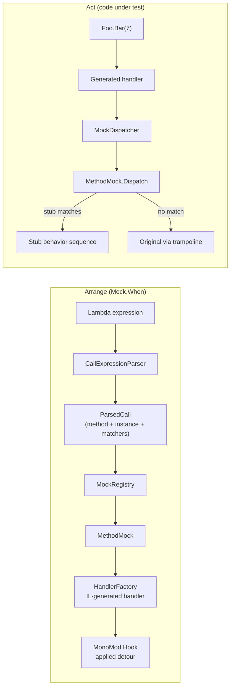

# Nem_Mockery Architecture

Nem_Mockery makes unmockable things mockable by **runtime method detouring**: while
a test runs, the compiled body of a real method is patched to jump into a generated
handler, and the patch is reverted when the test's `MockContext` disposes. Nothing
about the code under test changes — no proxies, no interfaces, no virtual dispatch.

## The pipeline

A `Mock.When(() => Foo.Bar(Arg.Any<int>())).ThenReturn(5)` call flows through four
stages; a later call to `Foo.Bar(7)` flows through the last two in reverse:



## Components

| Component | Responsibility |
|---|---|
| `Mock` | Public façade: `When`, `WhenSet`, `WhenNew`, `Verify*`. Parses expressions, registers stubs, formats failure messages. |
| `MockContext` | Disposable scope; owns claims on mocked methods and reverts everything on dispose. Ambient per async flow via `AsyncLocal`. |
| `CallExpressionParser` | Turns a stubbing/verification lambda into `ParsedCall` — the `MethodBase`, the evaluated receiver, and one `IArgumentMatcher` per parameter — without executing the target call. |
| `MockRegistry` | Process-wide `MethodBase → MethodMock` table. Holds strong references (MonoMod undoes a hook if its object is collected). |
| `MethodMock` | Per-method state: the MonoMod `Hook`, current stubs, recorded invocations, and the ownership gate. |
| `HandlerFactory` | Emits the `DynamicMethod` the real method is detoured to. |
| `DelegateTypeFactory` | Builds delegate types for arbitrary signatures (including by-ref), used for MonoMod's "orig" trampoline parameter. |
| `MockDispatcher` | The single static entry point generated handlers call; routes by mock id. |
| `Stub` / behaviors | One `When(...)` arrangement: matchers plus a sequence of `IBehavior` steps (`ThenReturn`, `ThenThrow`, `ThenAnswer`, `ThenCallOriginal`, `ThenDoNothing`). |

## Why these designs

### IL-generated handlers with one shared dispatcher

MonoMod requires the hook target to match the source method's signature exactly
(optionally with a leading "orig" delegate for calling the original). Signatures are
arbitrary, so `HandlerFactory` emits one small `DynamicMethod` per mocked method:

```
handler(origDelegate, [self,] p1, ..., pn):
  object[] a = box all slots            // by-refs are dereferenced
  object r  = MockDispatcher.Dispatch(mockId, origDelegate, a)
  write a[i] back through every by-ref slot   // ref/out params, struct 'this'
  return unbox(r)
```

Everything after the boxing boundary is ordinary C# in `MethodMock.Dispatch`. This
keeps the unavoidably delicate IL to ~60 opcodes of mechanical marshaling and puts
all matching/behavior logic where it can be read and tested.

The write-back loop is what makes `ref`/`out` parameters and mutating struct
methods work: the dispatcher (or a `ThenAnswer` via `SetArgument`, or the original
method via `DynamicInvoke`'s copy-back) updates the boxed array, and the handler
stores the elements back through the caller's references.

### Custom delegate types instead of `Expression.GetDelegateType`

The trampoline delegate must have the source method's exact signature. BCL helpers
cannot construct delegate types with by-ref parameters — and every struct instance
method has a by-ref `this` — so `DelegateTypeFactory` defines proper delegate types
with `TypeBuilder` and caches them per signature.

### Miss policy: fall through to the original

`MethodMock.Dispatch` answers a call from the newest matching stub; when nothing
matches it invokes the trampoline. Mocking a method therefore never silently
changes behavior the test didn't arrange — unmatched arguments and other instances
get real code (partial-mock/spy semantics). This was chosen over Mockito's
return-default policy because the mocked type is the *real* type: returning
`default` from an unstubbed sealed-class method would be far more surprising here
than it is on a Mockito proxy.

### Ownership gate instead of async-local routing

A detour affects the whole process, so two parallel tests mocking the same method
would see each other's stubs. Each `MethodMock` carries a `SemaphoreSlim` gate: the
first `MockContext` to stub the method owns it, contexts nested in the same async
flow (tracked by the `MockContext` parent chain) share the claim, and an unrelated
context blocks in `Claim` — with a 30-second timeout that produces a diagnostic
`MockeryException` naming the method, so a leaked context or a lock-order deadlock
fails loudly instead of hanging the run. The hook is applied on first claim and
undone (with recorded invocations cleared) when the last owner releases.

The rejected alternative — installing detours globally and routing per test with
`AsyncLocal` state — would allow full parallelism but makes stub visibility depend
on execution-context flow, which breaks silently for thread-pool callbacks and
custom schedulers. Serializing per method is slower but never wrong.

### Verification by recording every dispatched call

While a method is mocked, `Dispatch` records each call (receiver + boxed arguments)
before answering it, including fall-through calls. `Verify` re-parses its lambda
into matchers, counts matching recorded invocations, and marks them consumed so
`VerifyNoOtherCalls` can report anything unverified. Records die with the last
owning context, so tests cannot see each other's calls.

## Threading model

- `MockRegistry` and `MethodMock` state are lock-protected; user code (`Arg.Is`
  predicates, `ThenAnswer` callbacks) always runs outside the locks.
- `MockContext` itself is intended for single-threaded use within one test; the
  cross-test safety comes from the per-method ownership gate.
- `Stub` behavior sequencing uses an interlocked counter, so concurrent calls to a
  sequenced stub each take the next step.

## Known trade-offs

- `Delegate.DynamicInvoke` on the trampoline (fall-through and `ThenCallOriginal`)
  costs microseconds per call. Acceptable in tests; the readable alternative to
  more generated IL.
- Hooked-method dispatch takes a global registry lookup plus one lock; mocked hot
  loops will be measurably slower. Also acceptable in tests.
- JIT inlining and intrinsics can bypass or prevent detours (see README
  "Limitations"); this is inherent to entry-point patching and shared with every
  detour-based tool.
